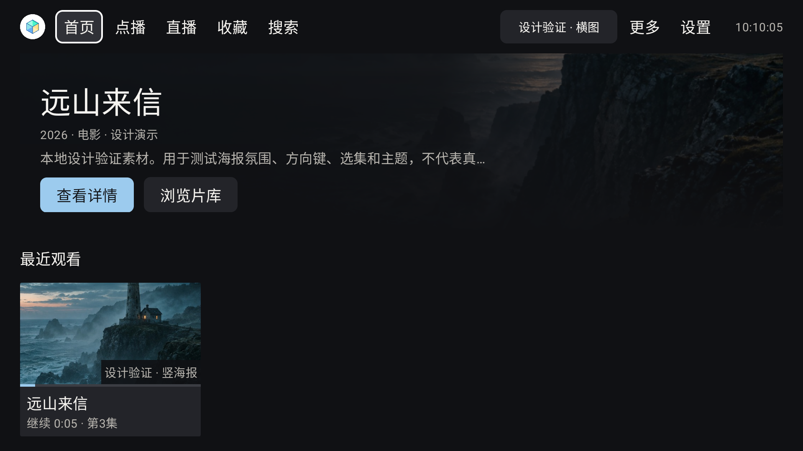
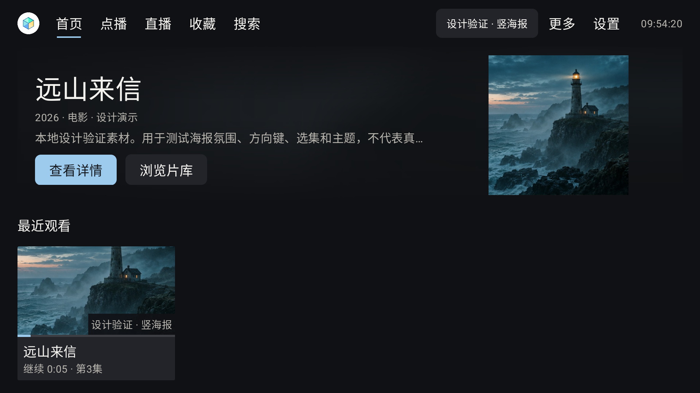
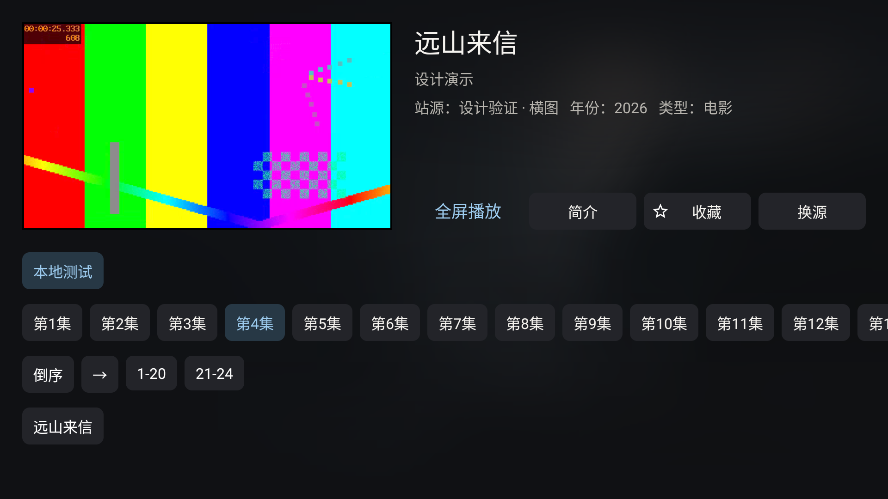
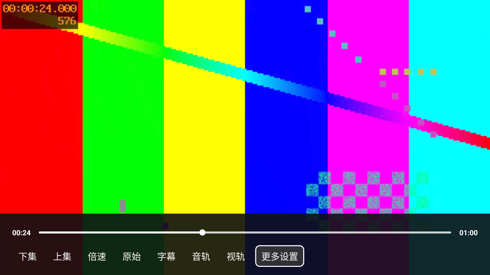
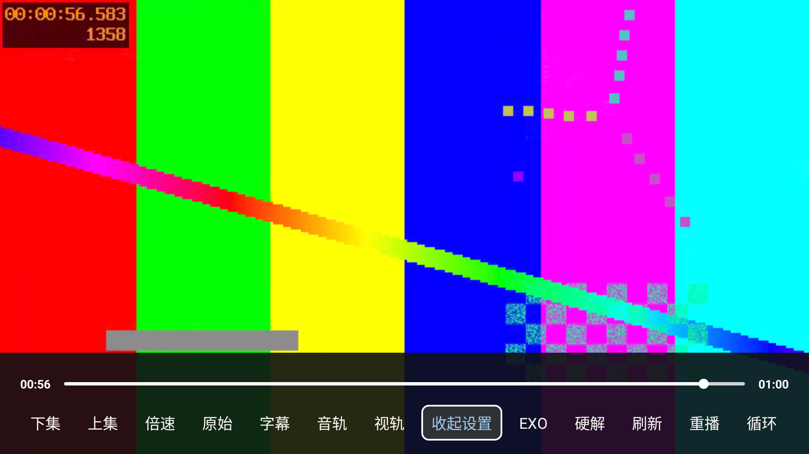
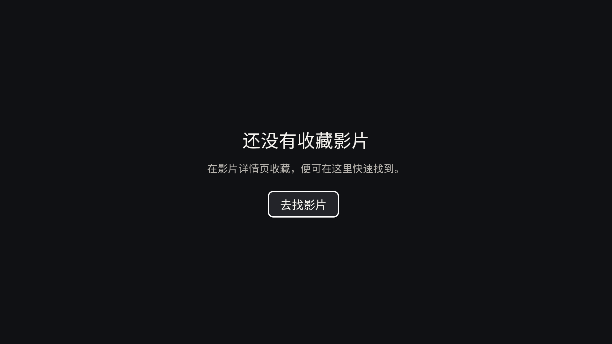

# A2.1 TV UI 实施与验证报告

日期：2026-09-09。状态：**已完成本轮 TV 实施与有限模拟器验收；不是全设备发布认证。**

用户确认执行 A2.1，并追加可扩展主题色与换肤要求。本轮仅改 `leanback` 生产代码，未修改 `main`、`mobile`、播放器内核、内容接口或 Gradle 依赖。未提交 Git commit；原有 `.gitignore`、设计资料和专家文档保留。

> 后续 UI 收尾与最新截图见 [TV_UI_POLISH.md](TV_UI_POLISH.md)。下文截图与验证数字保留为首轮记录；首页前景图片策略已调整为统一完整比例显示。

## 1. 已实现

| 区域 | 实际行为 |
|---|---|
| 首页 | 顶部首页/点播/直播/收藏/搜索；片源、更多、设置可见；功能磁贴收敛到导航/更多，推送与本地入口仍可达；片源入口左右键用于导航，确定/菜单键选源，不再吞左右键快速换源或闪烁 |
| Hero | 当前源首个有效条目，不额外请求详情、不伪造元数据、不自动轮播；无历史时采用紧凑布局，存在历史时保留完整续播卡片与标题 |
| 图片 | 合适横图以清晰图+暗色渐变展示；否则清晰原比例海报+同片低分辨率模糊；无图/失败稳定暗底。横图与模糊均限制在自身绘制边界 |
| 最近观看 | 独立横卡、真实播放位置、有效时长下的进度；无记录隐藏整组；菜单暴露管理和确认清空 |
| 详情与播放 | 保留 400×225dp 小窗及既有自动播放行为；明确全屏入口；线路/选集/元信息分层；高级播放控制收进“更多”，返回先收起再退出控制面板/全屏 |
| 直播 | 稳定深色面板、当前节目/选中节目标签、缺少 EPG 提示；保留原频道和播放逻辑，无新增节目数据能力 |
| 搜索 | 显式管理/清空历史，单条删除及清空均确认；保留原键盘、推荐词和搜索路由；删除后的焦点恢复有保护 |
| 收藏 | 无收藏时显示说明和“去找影片”，方向键确定进入搜索；删除最后一项切回空态并聚焦操作 |
| 设置 | 内容/网络、外观、播放、数据、关于分组；新增主题配色及影片氛围开关；换肤后恢复设置项焦点 |

## 2. 主题与扩展

入口：**设置 → 外观 → 主题配色**。

- 默认香槟金，另有冰川蓝、翡翠绿；三套均为暗色皮肤。
- 15 个 `tvColor*` 语义角色，集中调色板与文字/圆角/间距资源；页面、selector 通过 theme attrs 取色，而非按皮肤复制 XML。
- 强调色不等于焦点：白色描边表示遥控器焦点，强调色表达选中/主操作，徽标使用中性表面。
- `BaseActivity` 在 inflation 前应用皮肤。设置页和返回的非播放页可以重建；已有播放页保留创建时的皮肤/氛围快照，正常重新打开时才切换，避免换肤重启播放。
- 影片图不会改变全局强调色；关闭氛围不删除已有壁纸。浏览/工具页使用稳定底色；Home/Video 仅在氛围关闭时创建原壁纸 View，避免两种背景叠加运行。
- 新皮肤只追加 palette/style 与稳定 ID 映射；不重排已持久化 ID。完整 API、限制及步骤见 [TV_THEMING.md](TV_THEMING.md)。
- 当前不是浅色模式、在线皮肤市场或整个遗留应用的无重建实时换肤。新增浅色主题需另验图标/视频控制/遮罩。

## 3. 主要变更文件

所有下列 Java 路径均相对 `app/src/leanback/java/com/fongmi/android/tv/`：

- 主题：`utils/TvTheme.java`、`ui/base/BaseActivity.java`。
- 氛围：`ui/custom/FilmAtmosphereView.java`、`utils/AtmosphereTransformation.java`、`utils/AtmosphereBlur.java`。
- 首页/历史：`ui/activity/HomeActivity.java`、`ui/presenter/HeroPresenter.java`、`ui/presenter/HistoryPresenter.java`。
- 次级页面：`ui/activity/VideoActivity.java`、`LiveActivity.java`、`SettingActivity.java`、`SearchActivity.java`、`KeepActivity.java`。
- 数据展示：`ui/adapter/EpgDataAdapter.java`、`ui/adapter/RecordAdapter.java`。
- 资源（`app/src/leanback/res/`）：新增 `values/tv_attrs.xml`、`tv_colors.xml`、`tv_styles.xml`、`tv_dimens.xml`、`tv_home_styles.xml`；首页/历史新布局及 Hero/nav drawable；更新首页、详情、直播、搜索、收藏、设置、推送、聚合页及卡片/控制栏布局；原有焦点/选中 selector 底层 shape 改用语义属性。
- 文案：`values`、`values-zh-rCN`、`values-zh-rTW` 下四组 `tv_*_strings.xml`。
- 测试：`tools/tests/test_tv_theme_resources.py`、`tools/tests/test_tv_record_adapter.py`；`app/src/testLeanback/java/com/fongmi/android/tv/utils/AtmosphereBlurTest.java`、`FilmAtmosphereViewContractTest.java`。
- 文档：`DESIGN.md`、`docs/UI_UX_A2_EXECUTION_PLAN.md`、`docs/TV_THEMING.md`、本报告及截图。

**简化原则**：复用 Leanback、Glide、现有路由/播放器与资源文件名；删除首页冗余功能磁贴和空历史占位，不引入第二套 UI 框架、模糊依赖或一皮肤一页面的副本。

## 4. 验证证据

### 构建与静态检查

| 检查 | 结果与解释 |
|---|---|
| `:app:assembleLeanbackDebug` | **通过**，包含完整资源链接、Java 编译及 APK 打包；最终包已安装至 `emulator-5554` |
| 默认 `:app:lintLeanbackDebug` | **未通过**：4 errors / 177 warnings；4 项 error 均在未修改的 Manifest 中，见下文 |
| 仅过滤 4 个已知基线 ID 后的 TV lint | **通过**；临时 init script，不写入项目 lint 配置，不代表默认 lint 通过，也不代表零警告 |
| Mobile 编译/检查尝试 | **受已有资源缺失阻塞**，未通过；本轮未改 mobile，不以 TV 成功代替 mobile 成功 |
| XML/资源/对比度/生命周期断言 | **8 项通过**；资源及源码级检查，不是 Android instrumentation |
| RecordAdapter | **12 项通过**；实际 adapter 编译执行，Android/Gson/preferences 为显式边界 stub |
| 静态模糊算法 | **7 项纯 Java 检查通过** |
| 氛围请求契约 | **4 项源码不变量通过**，不是异步运行时压力测试 |
| `git diff --check` | **通过** |

默认 TV lint 的四个错误 ID：`MissingLeanbackLauncher`、`ImpliedTouchscreenHardware`、`MissingIntentFilterForMediaSearch`、`MissingLeanbackSupport`。本轮没有通过修改 Manifest 或持久化关闭规则来隐藏它们。

Mobile 的 `MpvConfDialog.java` 引用了不存在的 `dialog_import`、`player_mpv_conf_conflict_hint`、`player_mpv_conf_priority_hint`、`player_mpv_conf_import_failed` 字符串，另有由此引起的 `setText` 重载歧义。相关源文件及资源相对基线 HEAD `5ff7fd2297c6ae84967cf5c5c5c7a20d83c70a1e` 未改动；这是源码差异证据，**未另建隔离 HEAD 工作区完整复跑**。

本地原始日志：`.omx/state/tv-ui-implementation/` 下 `build-final.log`、`lint-tv-unfiltered.txt`、`lint-tv-filtered.log`、`verification-build.log`。可能包含本机路径，不作为发布包内容。

### 可重跑测试

```sh
python3 tools/tests/test_tv_theme_resources.py
python3 tools/tests/test_tv_record_adapter.py
mkdir -p /tmp/tv-ui-tests
javac -d /tmp/tv-ui-tests \
  app/src/leanback/java/com/fongmi/android/tv/utils/AtmosphereBlur.java \
  app/src/testLeanback/java/com/fongmi/android/tv/utils/AtmosphereBlurTest.java \
  app/src/testLeanback/java/com/fongmi/android/tv/utils/FilmAtmosphereViewContractTest.java
java -cp /tmp/tv-ui-tests com.fongmi.android.tv.utils.AtmosphereBlurTest
java -cp /tmp/tv-ui-tests com.fongmi.android.tv.utils.FilmAtmosphereViewContractTest
./gradlew :app:assembleLeanbackDebug
./gradlew :app:lintLeanbackDebug  # 当前默认预期受上述已有错误阻塞
```

### 模拟器验收边界

1080p Android TV 模拟器，使用本机临时源、虚构片名/生成图和 60 秒测试视频，不把真实源地址、凭据或用户数据库作为设计素材。

已观察：竖海报模糊、横图、空内容引导；默认焦点及片源切换；返回窗口时为空/根网格焦点提供可见导航兜底；小窗播放、24 集分段、全屏返回；高级控制展开、返回收起并保留“更多设置”焦点；真实续播记录；纯方向键跨过片源入口进入设置，冰川蓝/翡翠绿皮肤选择与返回首页重着色、焦点保持；收藏空态确定进入搜索；搜索清空确认面板可达。

尚需真机专项：低端盒子/API 24、4K/720p、大字号、TalkBack、图/视频合成对比度、长时间快速换源、后台内存压力、动态壁纸、自定义图片请求头的真实源回归、播放中跨栈换肤、真实直播/多线路/字幕音轨与 Cast。当前没有可据以承诺帧率或无障碍认证的数据。

## 5. 交付物与后续

- TV arm64 Debug APK：`app/build/outputs/apk/leanback/debug/app-leanback-arm64-v8a-debug.apk`。
- 同目录同时生成 armeabi-v7a APK。此为 Debug 构建，不是正式发布签名包。
- 设计基线：[DESIGN.md](../DESIGN.md)；阶段交接：[A2.1 执行方案](UI_UX_A2_EXECUTION_PLAN.md)。
- 推荐下一步：在目标电视实测并校准密度/大字号；单独处理已有 Manifest lint 和 mobile 缺失文案，避免混入本轮视觉变更。


## 6. 实际界面截图

以下来自模拟器与本地虚构素材，非生成的最终效果承诺；当前所选皮肤为冰川蓝。截图中彩条是实际播放的测试视频。

| 首页横图 | 海报降级 |
|---|---|
|  |  |

| 详情与小窗 | 常用播放控制 |
|---|---|
|  |  |

| 更多播放控制 | 收藏空态 |
|---|---|
|  |  |

[首页空内容引导](images/tv-a2-implementation/home-empty.png)。视觉复核已修正 Hero 裁切，所观察的首页/空态符合 A2.1 层级方向；不把概念图的虚构数据数量作为验收要求。

[翡翠绿换肤后返回首页，设置焦点保持](images/tv-a2-implementation/home-jade.png)。

## 7. 测试环境收尾

临时模拟器配置/偏好和数据库已恢复至测试前备份，逐文件字节比较通过（等待 ADB 解包写入结束后核对）；临时源服务及 ADB 端口转发已关闭。保留最新 Debug APK 安装，应用处于停止状态，下一次启动读取原有用户配置。私有备份、测试视频与源脚本只保留在被 Git 忽略的 `.omx/`，未作为文档素材发布。
